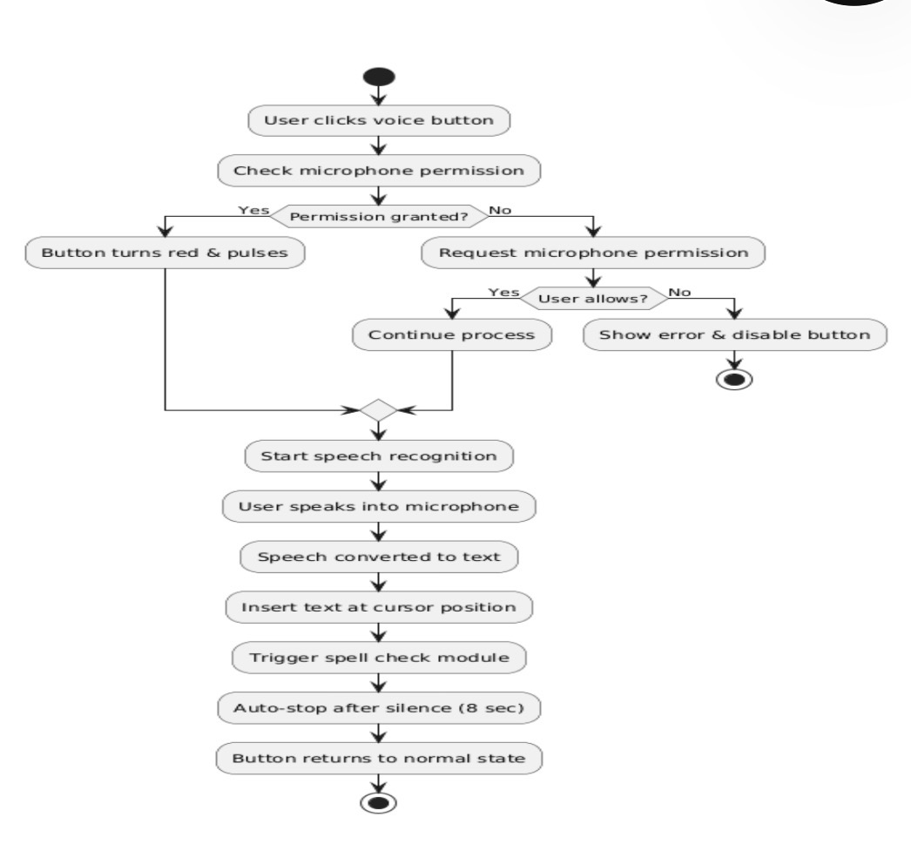
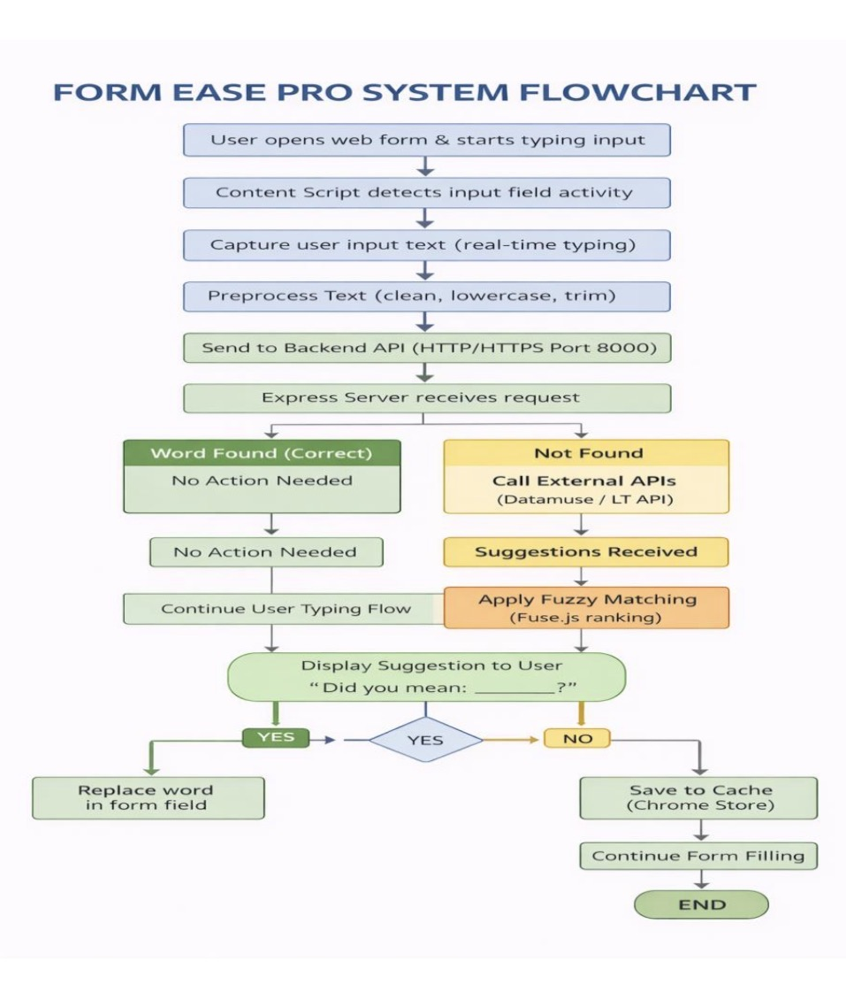
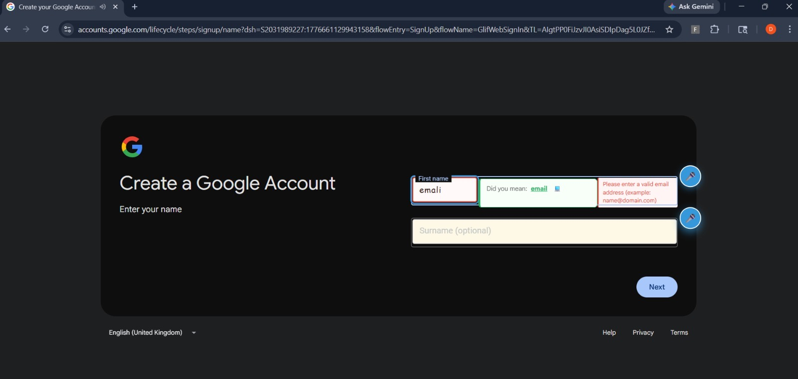
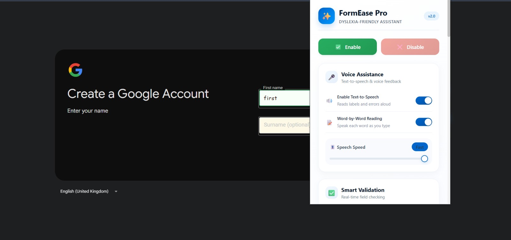

# 🧠 FormEase: Dyslexia Form Assistant

A Chrome browser extension that helps users with dyslexia complete online forms using real-time spell correction and intelligent suggestions.

## 🚀 Features

- Real-time spell correction
- Smart word suggestions
- Accessible form completion
- Chrome browser extension
- Lightweight and fast

## 📸 Demo

### Screenshot 1


### Screenshot 2


### Screenshot 3


### Screenshot 4


## 🛠️ Tech Stack

- HTML
- CSS
- JavaScript
- Node.js
- Express.js
- Chrome Extension API
- Levenshtein Distance Algorithm

## 📂 Project Structure

```text
extension/
routes/
server.js
package.json
```

## 👨‍💻 Author

Akhil K
